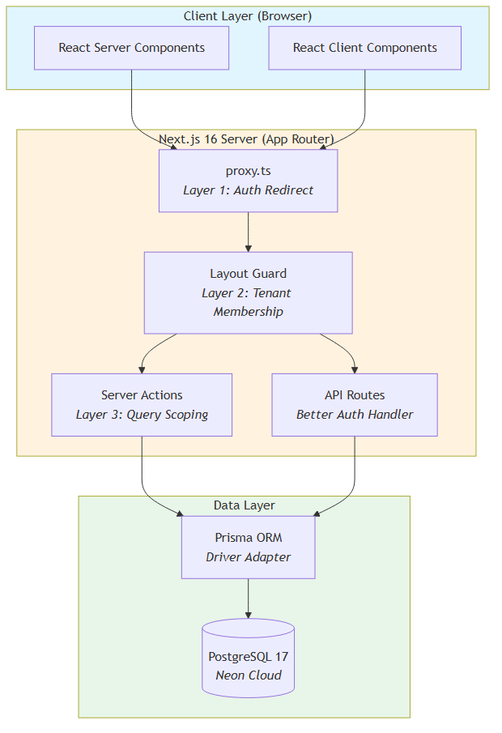
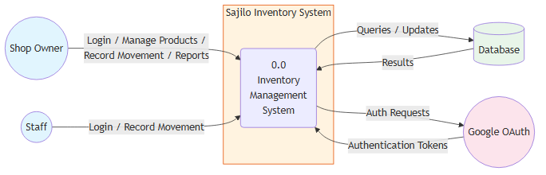
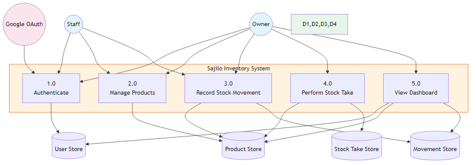
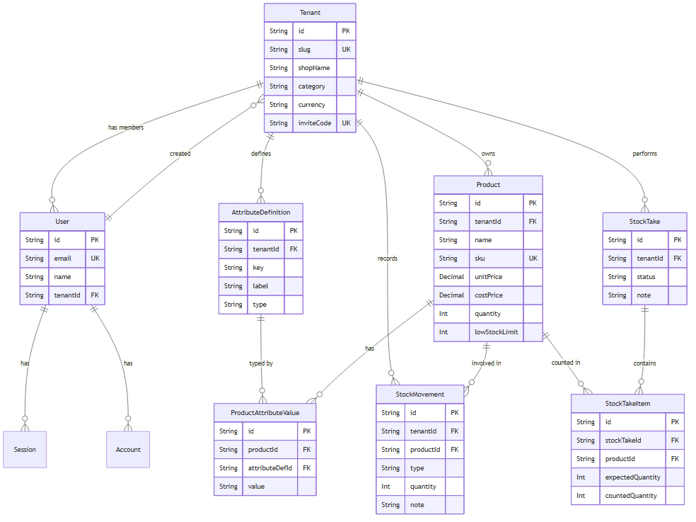
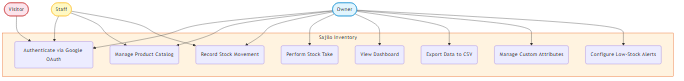
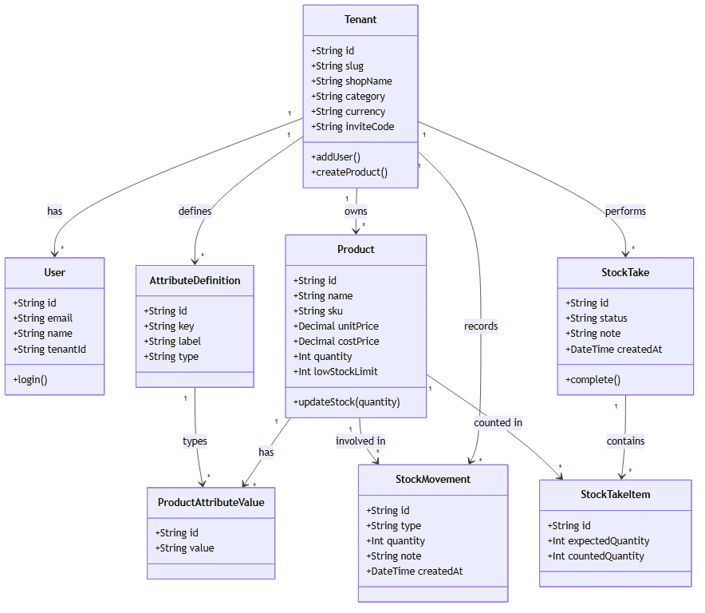
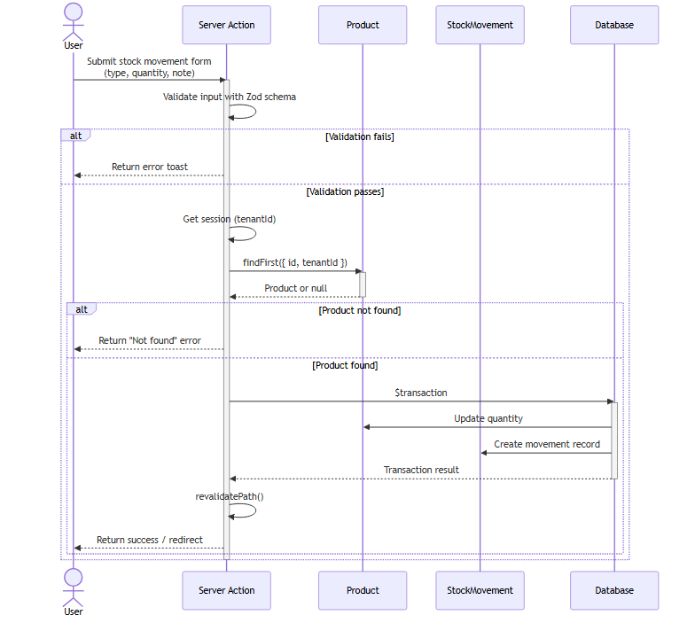
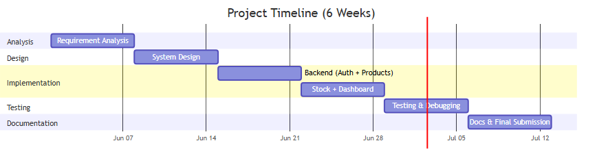

# Project Synopsis: Sajilo Inventory — A Multitenant Inventory Management System Using Next.js and PostgreSQL

**Submitted by: Abhay Kumar Mandal**

---

## Introduction / Background

Inventory management constitutes a fundamental operational function for retail businesses of all scales. Despite its importance, a significant proportion of small shop owners in Nepal and other developing regions continue to rely on manual record-keeping methods, including handwritten ledgers and standalone spreadsheet applications. These approaches are inherently susceptible to human error, consume considerable time, and fail to provide real-time visibility into stock levels. Consequently, businesses face recurring challenges such as overstocking, stockouts, and financial losses. As digital transformation accelerates across the small enterprise sector, there is growing demand for affordable, accessible inventory management solutions.

Contemporary web technologies have substantially lowered the barriers to developing sophisticated business applications that were once the exclusive domain of large enterprises with significant IT budgets. Modern frameworks enable the creation of full-stack applications with server-side rendering, secure API architectures, and type-safe database access. These advances, combined with robust relational database systems, provide the technical foundation for building scalable, multitenant platforms that can serve multiple organizations from a single deployment.

The proposed system, Sajilo Inventory, is a web-based, multitenant inventory management application designed to enable multiple independent shops to manage their inventory within a single platform while maintaining complete data isolation. Each tenant is provided with an independent product catalog, configurable custom attributes, stock movement tracking, and automated low-stock alerting — delivered through a modern, responsive interface tailored to the operational realities of small shop owners.

---

## Problem Statement

Small shop owners face significant challenges managing inventory manually. Tracking product quantities, recording stock movements, monitoring expiry dates, and reconciling physical stock against records are tedious processes prone to human error. When a shop has hundreds of products, a spreadsheet-based approach becomes unmanageable. Stock discrepancies go unnoticed until a customer asks for an out-of-stock item, leading to lost sales and dissatisfied customers.

Existing solutions in the market are not well-suited to the needs of small shops. Enterprise resource planning (ERP) systems like Odoo and SAP are too expensive and complex. Spreadsheets lack real-time collaboration and audit trails. Off-the-shelf inventory software typically supports only a single business, forcing multi-branch owners to maintain separate systems. There is no centralized, affordable system that supports multiple shops with isolated data while providing real-time stock insights, automated alerts, and an intuitive interface.

**There is a clear need for an automated, multitenant, and secure inventory management system designed specifically for small shop owners.**

---

## General Objective

To develop a secure, multitenant inventory management web application that enables small shop owners to efficiently track stock, record movements, and receive low-stock alerts.

## Specific Objectives

- To implement a multitenant architecture with complete data isolation between shops using tenant-scoped database queries.
- To design a product catalog with support for custom attributes per tenant, allowing each shop to define its own product fields without code changes.
- To build a stock movement tracking system with transactional integrity, ensuring that every quantity change is recorded in an immutable audit trail.
- To develop low-stock and expiry alert features that proactively notify shop owners when products need attention.
- To provide a stock-taking workflow for periodic inventory reconciliation with discrepancy reporting.
- To deliver a responsive, mobile-friendly user interface with dark mode support and fast loading states.

---

## Scope of the Project

The system covers product catalog management, custom attribute definitions per tenant, stock IN/OUT recording with audit trails, low-stock and expiry alerts, stock take workflows, CSV export of products and movements, and a summary dashboard with key performance metrics.

**Included:**
- Google OAuth authentication with session management
- Tenant (shop) creation and member invitation via invite codes
- Product CRUD with search and pagination
- Custom attribute definitions (text, number, date types) per tenant
- Stock movement recording (IN/OUT) with insufficient-stock guards
- Stock take lifecycle (start, count, complete, cancel)
- Low-stock and expiry alert highlighting on dashboard and product detail pages
- CSV export for products and stock movements
- Dark mode, responsive design, and PWA support

**Excluded:**
- Email/password authentication (Google OAuth only)
- Offline mode or local data caching
- Billing, invoicing, or point-of-sale (POS) integration
- Role-based access control beyond owner/member distinction
- Third-party API integrations (e-commerce platforms, accounting software)
- Mobile native applications (responsive web only)

**Target Users:** Small shop owners and their staff in Nepal.

---

## Significance of the Project

**For Shop Owners:** Real-time stock visibility reduces the risk of stockouts and overstocking. Automated low-stock alerts eliminate the need for manual inventory counts. The audit trail provides accountability for stock movements.

**For Organizations:** Operational efficiency improves through centralized data management. Better purchasing decisions are enabled by historical stock data. The multitenant architecture makes the system cost-effective — multiple shops share one infrastructure while maintaining data privacy.

**For Society:** Affordable inventory management technology reaches small businesses that were previously priced out of digital solutions. This supports local economic development by helping small shops operate more professionally.

**For the Developer:** The project provides hands-on experience with modern full-stack web development (Next.js, TypeScript, Prisma, PostgreSQL), authentication patterns (OAuth, session management), multitenant database design, and production-grade testing with Vitest.

---

## Literature Review

**1. Madamidola, Daramola, Akintola, and Adeboje (2024)** conducted a comprehensive review of existing inventory management systems (IMS), tracing their evolution from manual methods through barcode scanning, RFID, and IoT-enabled solutions. Their study highlighted that while modern technologies have improved tracking accuracy, significant challenges remain in integrating IMS with other business processes, particularly in complex, multi-location environments. The review identified a persistent gap in affordable, scalable solutions for small and medium-sized enterprises.

**2. Pedraza, Angeles, Enriquez, and Pamen (2025)** developed a cloud-based online inventory management system designed specifically for small and medium-sized businesses. The system introduced real-time stock tracking, automated low-stock alerts, role-based access control, and comprehensive reporting tools using web technologies. Their study demonstrated that digital inventory solutions significantly improve inventory visibility and reduce human error compared to traditional manual methods.

**3. Adhikari and Molla (2024)** investigated the impact of digital technology on management practices in small and medium enterprises in Nepal. Their mixed-methods study of 300 management members across seven SMEs found that digitalization significantly enhances decision-making, customer support, and operational collaboration. The research underscored that Nepali SMEs face unique barriers to digital adoption, including limited infrastructure and technical expertise.

**4. Musuluri (2024)** explored how cloud-enabled innovation has transformed inventory management and demand forecasting in the retail sector. The study examined core cloud platform solutions, implementation strategies, and future trends, demonstrating that cloud integration enables real-time data processing, predictive analytics, and supply chain optimization — capabilities previously available only to large enterprises with significant IT budgets.

**5. Erameh and Odoh (2021)** designed and implemented a web-based inventory control system using a small and medium enterprise as a case study. Their system addressed common SME challenges such as overstocking, understocking, and inaccurate record-keeping. The research demonstrated that web-based platforms can effectively replace manual inventory processes at a fraction of the cost of enterprise solutions.

**6. Balavishnu, Viswanathan, Chitradevi, Mohana Priya, and Rajkumar (2021)** developed a stock management system focused on quality control in businesses handling consumer goods. Their system featured automated stock tracking, real-time quantity monitoring, and alert mechanisms for low-stock conditions. The study emphasized that automated stock management systems significantly minimize recording errors and improve operational efficiency.

**7. Gap Identified:** While existing research covers inventory management from various angles — cloud-based systems, SME-focused solutions, Nepal-specific digitalization, and stock alert mechanisms — no single system combines multitenancy with custom dynamic attributes, stock take workflows, automated low-stock alerts, and a modern responsive user interface in a lightweight package tailored to small Nepali shops. Sajilo Inventory fills this gap by providing a purpose-built, multitenant solution using Next.js, Prisma, and PostgreSQL.

---

## Proposed Methodology / System Approach

The project follows the **Agile development methodology** with iterative two-week sprints. Agile was chosen because requirements evolved during development as the team gained deeper understanding of small shop workflows. Each sprint delivered a working, testable increment — starting with authentication, then products, then stock movements, then dashboard, and finally testing and hardening.

**Technology Stack:**

- **Programming Language:** TypeScript (primary), Python (seed scripts)
- **Framework:** Next.js 16 with App Router and React 19
- **ORM:** Prisma 7 with `@prisma/adapter-pg` driver adapter
- **Database:** PostgreSQL 17
- **Authentication:** Better Auth with Google OAuth provider
- **Styling:** Tailwind CSS v4 with shadcn/ui component library
- **Validation:** Zod v4 for schema validation and type inference
- **Testing:** Vitest v4 with 45 unit and isolation tests
- **Version Control:** Git
- **Package Manager:** pnpm
- **IDE:** VS Code

---

## System Requirements

### Hardware Requirements

| Component | Minimum Specification |
|---|---|
| Processor | Intel Core i3 or equivalent |
| RAM | 4 GB (8 GB recommended) |
| Storage | 128 GB free disk space |

### Software Requirements

| Component | Specification |
|---|---|
| Operating System | Windows 10/11, Linux, or macOS |
| IDE | VS Code (or equivalent) |
| Database Server | PostgreSQL 17 |
| Runtime | Node.js 20.9 or higher |
| Package Manager | pnpm 8+ |
| Web Browser | Chrome, Firefox, or Edge (latest versions) |

---

## System Architecture / System Design

### System Architecture

The system follows a **three-tier client-server architecture**. The presentation tier consists of React client components running in the browser. The application tier runs on the Next.js server, which handles server-side rendering, API routes, and Server Actions. The data tier is PostgreSQL, accessed through the Prisma ORM with a driver adapter pattern.

A proxy layer (`proxy.ts`) provides the first authentication guard at the network edge. The tenant layout (`[tenantSlug]/layout.tsx`) enforces session validation and tenant membership as the real security boundary. Every Server Action independently verifies authorization and scopes all queries by `tenantId`.

### Data Flow Diagrams

The context-level DFD (Level 0) shows three external entities — Shop Owner, Shop Staff, and Google OAuth — interacting with a single Sajilo Inventory system. The Level 1 DFD decomposes the system into six processes: Authentication, Product Management, Stock Movement, Stock Take, Dashboard, and CSV Export.

### Entity-Relationship Diagram

The database consists of 11 tables. The core business entities are `Tenant`, `Product`, `AttributeDefinition`, `ProductAttributeValue`, `StockMovement`, `StockTake`, and `StockTakeItem`. Authentication models (`User`, `Session`, `Account`, `Verification`) are managed by Better Auth. All tenant-scoped tables include a `tenantId` foreign key with appropriate indexes.

### UML Diagrams

The use case diagram captures five actors (Owner, Staff, Visitor, Google OAuth, System) and use cases including Authenticate, Manage Products, Record Movement, Perform Stock Take, View Dashboard, and Export Data. The class diagram maps all 11 database models with their relationships. The sequence diagram illustrates the stock movement recording flow: user submits form → Server Action validates → transaction executes → Prisma updates product + creates movement → page revalidates.

---

## Modules and Functional Description

### Authentication Module
Handles Google OAuth sign-in and sign-out via Better Auth. Manages session creation, validation, and destruction. Integrates with the three-layer defense-in-depth security model. On first sign-in, creates a new user record with optional tenant assignment.

### Tenant Management Module
Provides shop creation with name and category selection. Generates unique invite codes for adding members. Supports owner-only operations including invite code regeneration, member removal, and financial visibility toggling. Uses slug-based URL routing for tenant identification.

### Product Catalog Module
Supports full CRUD operations for products with fields for name, SKU (unique per tenant), unit price, cost price, quantity, low stock limit, and unit of measurement. Features search by name or SKU with pagination (20 products per page). Displays stock status badges (OK, Low, Out) with color coding.

### Custom Attributes Module
Allows each tenant to define custom product fields with a key, display label, and type (text, number, or date). Product create and edit forms dynamically render the appropriate input fields based on the tenant's attribute definitions. Attribute values are stored in a separate `ProductAttributeValue` table.

### Stock Movement Module
Records stock IN and OUT transactions with an immutable audit trail. Each movement stores the type, quantity, product ID, and timestamp. Uses Prisma `$transaction` to atomically update product quantity and create the movement record. Prevents OUT movements when stock is insufficient.

### Stock Take Module
Supports periodic inventory reconciliation through a workflow: start a stock take (snapshot of current quantities), count each product (with auto-save on input), and complete with optional quantity adjustments. Only one active stock take per tenant is allowed at a time. Completion automatically creates adjustment stock movements.

### Dashboard Module
Displays summary metric cards (Total Products, Low Stock Items, Out of Stock, Expiring Soon) calculated via raw SQL for accuracy. Shows a low-stock product list sorted by quantity ascending. Highlights products expiring within 30 days. Links to active stock takes.

### CSV Export Module
Provides authenticated API routes for exporting products and stock movements as CSV files. Responses include `Content-Disposition: attachment` headers for browser download. Routes are scoped by tenant slug and require valid session authentication.

### Settings Module
Combines attribute definition management (create, edit, delete), invite code display and regeneration, member list with removal capability, and financial visibility toggle. Provides a single-page interface for all tenant configuration.

---

## Expected Output / Deliverables

- Working web application prototype deployable on Vercel
- Complete TypeScript source code in a Git repository
- PostgreSQL database schema with migration files
- Seed scripts for demo data (Liquor Shop and Bicycle Shop)
- Project documentation (synopsis, architecture, database schema, auth flow, API reference, setup guide, deployment guide, testing guide, features overview)
- Testing report with 45 passing tests (38 unit + 7 isolation)
- Screenshots of all key system screens
- PWA manifest and service worker for installable web app experience

---

## Project Timeline / Gantt Chart

The project was developed over a 6-week period, with each phase building on the previous one.

| Phase | Wk 1 | Wk 2 | Wk 3 | Wk 4 | Wk 5 | Wk 6 |
|---|---|---|---|---|---|---|
| Requirement Analysis | █ | | | | | |
| System Design | | █ | | | | |
| Implementation | | | █ | █ | | |
| Testing & Debugging | | | | | █ | |
| Documentation & Final Submission | | | | | | █ |

---

## Limitations

- Google OAuth is the sole authentication method; no email/password or phone-based login is available.
- The application requires an active internet connection and has no offline mode.
- Mobile app is not provided; the system relies on responsive web design for mobile access.
- Single-language interface (English only in the current version).
- Scalability is limited without additional database optimization for very large data volumes (millions of products).

---

## Future Enhancements

- Email and password authentication as an alternative to Google OAuth.
- Native mobile application using React Native or Flutter for offline-first experience.
- Barcode and QR code scanning for rapid product entry and stock taking.
- AI-powered demand forecasting and automatic reorder suggestions based on historical movement data.
- Multi-language support (Nepali, Hindi, and other regional languages).
- Advanced analytics dashboard with interactive charts, trend lines, and exportable reports.
- Third-party integrations with e-commerce platforms (Shopify, Esewa) and accounting software.

---

## Conclusion

Sajilo Inventory is a modern, multitenant inventory management web application designed to address the inventory tracking challenges faced by small shop owners in Nepal. By combining Next.js 16, Prisma 7, PostgreSQL, and Google OAuth, the system delivers secure, real-time stock visibility with complete data isolation between tenants. The application covers the full inventory management lifecycle — product catalog with custom attributes, stock movement auditing, low-stock and expiry alerts, periodic stock takes, and CSV export — all within a responsive, dark-mode-enabled interface with fast loading states. With 45 passing tests and a three-layer defense-in-depth security model, Sajilo Inventory provides a robust foundation for small businesses to digitize their inventory operations. The system is well-positioned for future growth through mobile applications, AI-powered features, and broader language support.

---

## References

Adhikari, S. N., & Molla, N. (2024). Navigating the digital shift: Exploring the impact of technology on management practices in small and medium enterprises (SMEs) in Nepal. *Nepalese Journal of Management and Technology*, 2(2). https://doi.org/10.3126/njmt.v2i2.68730

Balavishnu, M., Viswanathan, D., Chitradevi, K., Mohana Priya, V., & Rajkumar, N. (2021). Stock management system. *International Journal of Scientific Research in Computer Science, Engineering and Information Technology*, 7(2), 342–347. https://doi.org/10.32628/CSEIT217286

Erameh, K., & Odoh, B. (2021). Design and implementation of a web-based inventory control system using a small medium enterprise (SME) as a case study. *NIPES Journal of Science and Technology Research*, 3(3), 211–219.

Madamidola, O. A., Daramola, O. A., Akintola, K., & Adeboje, O. (2024). A review of existing inventory management systems. *International Journal of Research in Engineering and Science*, 12(9), 40–50.

Musuluri, C. T. (2024). Cloud-enabled innovation in retail: Transforming inventory management and demand forecasting. *ResearchGate*. https://doi.org/10.13140/RG.2.2.387200774

Pedraza, J. S., Angeles, A. A., Enriquez, J. A., & Pamen, J. M. (2025). Online inventory management system: A web-based inventory management solution for business operations. *ResearchGate*. https://doi.org/10.13140/RG.2.2.391744160
